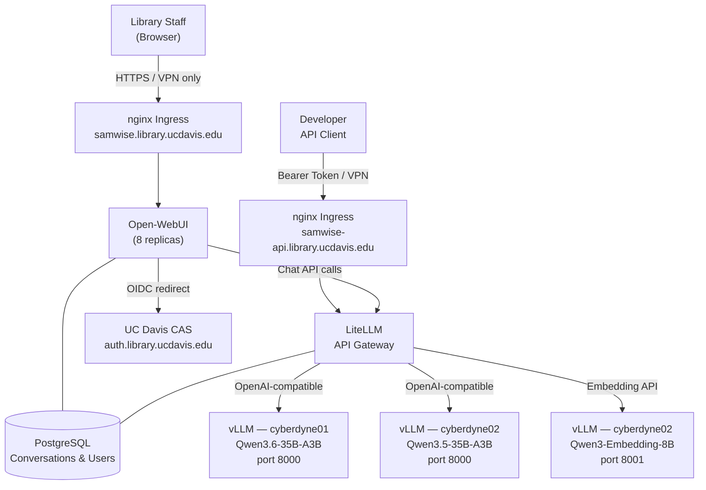
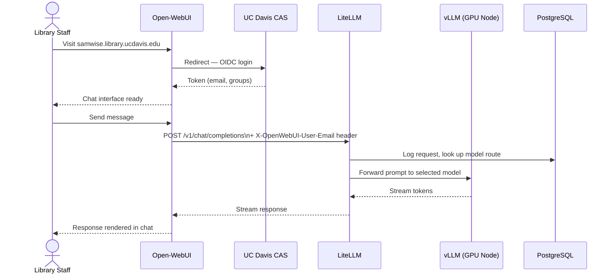
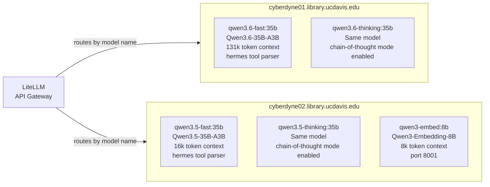
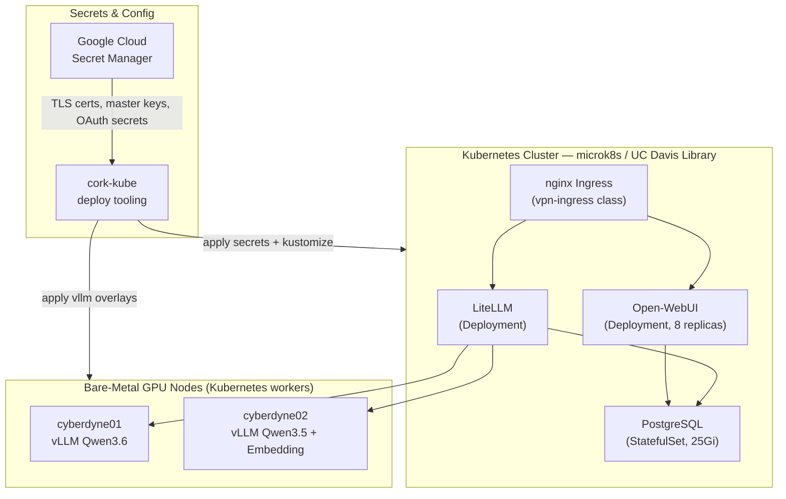

# Samwise

**A private, on-premises AI assistant platform for UC Davis Library staff.**

---

## What Is Samwise?

Samwise is the UC Davis Library's internally hosted artificial intelligence platform. It gives Library staff access to large language models (LLMs) — the same class of technology powering tools like ChatGPT — without sending any data to external companies. All conversations, queries, and documents shared with the system remain entirely within Library and UC Davis infrastructure.

The platform is built on open-source AI models and self-hosted infrastructure. This means the Library controls what models run, who can access them, how usage is tracked, and what data is retained — with no per-query licensing fees and no dependency on third-party AI providers. The ongoing cost is the electricity and hardware already allocated to the Library's server infrastructure.

Today, Samwise supports conversational AI assistance and text embeddings (a building block for search and document intelligence). Beyond text conversation, the platform supports image and document analysis, and has been validated as a backend for autonomous AI agents — enabling workflows where the AI iterates through multi-step tasks without continuous human prompting. It is designed to grow: additional models, document ingestion, and application-specific AI tools can be added as Library needs evolve.

---

## Who Uses It and How

Samwise is available to all Library staff on the UC Davis network or VPN. There is no separate account to create — staff log in with their existing UC Davis credentials through the standard UC Davis authentication system (CAS).

**Accessing Samwise:** Open a browser and go to `samwise.library.ucdavis.edu`. The interface is a familiar chat-style application similar to ChatGPT or Claude.

**Currently Available Models**

| Model | Best For |
|---|---|
| `qwen3.5-fast:35b` | Quick questions, drafting, summarization — fastest response |
| `qwen3.5-thinking:35b` | Complex reasoning, analysis, multi-step problems — slower but more thorough |
| `qwen3.6-fast:35b` | Same as above with a newer model generation; supports very long documents (131k context) |
| `qwen3.6-thinking:35b` | Deep reasoning with extended context — best for research-grade tasks |
| `qwen3-embed:8b` | Embedding API for developers building search or semantic similarity features |

All models support **tool/function calling**, enabling AI agents that can invoke external systems as part of a workflow.

**For Developers:** Open-WebUI exposes an OpenAI-compatible API at `samwise.library.ucdavis.edu/api`. Any code written against the OpenAI API can point at Samwise instead with only a base URL and key change.

---

## System Architecture

Samwise is composed of four services that work in a layered stack:

| Layer | Component | Role |
|---|---|---|
| UI | **Open-WebUI** | Chat interface served to staff browsers. Handles authentication, conversation history, and user settings. Runs as 8 replicas for availability. |
| Gateway | **LiteLLM** | OpenAI-compatible API proxy. Routes requests to the correct model backend, enforces API keys, tracks per-user usage, and stores configuration in the database. |
| Inference | **vLLM** | Runs the actual AI models on GPU hardware. Each model deployment is pinned to a specific physical node via Kubernetes node selectors. |
| Persistence | **PostgreSQL** | Stores conversation history, user data, LiteLLM configuration, and usage logs. |

**Authentication flow:** Staff arrive at Open-WebUI, are redirected to UC Davis CAS (Keycloak at `auth.library.ucdavis.edu`), authenticate with their UCD credentials, and are returned with a session token. Password authentication is disabled — only institutional SSO is permitted. The user's email is forwarded to LiteLLM via a header so usage can be tracked per individual without storing credentials.

**Secrets and configuration** are managed through Google Cloud Secret Manager and applied to the cluster at deploy time via `cork-kube`. TLS certificates are provisioned for both public-facing endpoints.

**Access is VPN-scoped:** The Kubernetes ingress class is `vpn-ingress`, meaning both the web UI and API are only reachable from the UC Davis network or VPN.

---

## Infrastructure Diagrams

### System Topology

---

### Request Flow

---

### GPU Node Layout

---

### Deployment Stack

